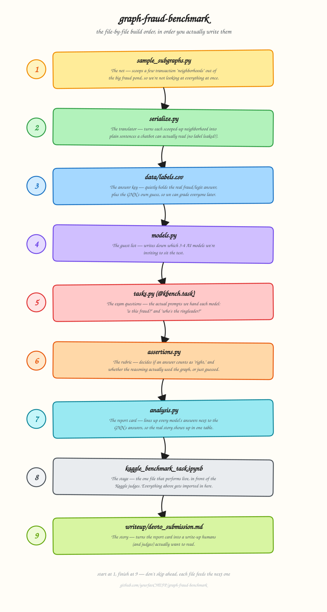

# Kaggle Benchmarking Challenge — Full Architecture

**Project:** `graph-fraud-benchmark` — an LLM graph-fraud reasoning benchmark, built on `graph-fraud-ai`
**Deadline:** October 11, 2026 (dev.to × Kaggle Benchmarking Challenge, $2,500 across five winners)

This single document has everything needed to cook this project end-to-end: the idea, the phases, the root directory, the README, the requirements file, and a file-by-file build order explained simply enough to follow without getting lost — plus a visual map of the sequence.

---

## 1. The Core Idea

Extract labeled subgraphs from the existing IEEE-CIS fraud data, serialize them into text/JSON an LLM can read, and test whether models catch fraud that's only visible through multi-hop relationships — the exact signal the trained heterogeneous GNN (`graph-fraud-ai`) was built to exploit. The GNN's own predictions on the same subgraphs become a second reference point, not just the raw label — so the finding becomes *"the LLM missed the same ring pattern the GNN's message-passing caught,"* not just an accuracy number.

## 2. Phases

| Phase | Goal | Target |
|---|---|---|
| **1 — Data** | Sample & serialize subgraphs, freeze ground truth | Days 1–2 |
| **2 — Tasks** | Write `@kbench.task` functions + assertions | Days 3–4 |
| **3 — Models** | Configure model lineup, dry-run on Kaggle notebook | Day 5 |
| **4 — Run & analyze** | Full benchmark run, build the LLM-vs-GNN agreement analysis | Days 6–8 |
| **5 — Writeup** | dev.to submission using their template | Days 9–10 |

Leaves several days of slack before Oct 11 — don't let phase 4's analysis expand to fill it; the insight is the deliverable, not more runs.

## 3. Project Root Directory

```
graph-fraud-benchmark/
├── README.md
├── requirements.txt
├── data/
│   ├── raw/                     # symlink/copy from graph-fraud-ai's IEEE-CIS subset
│   ├── subgraphs/                # extracted, serialized k-hop samples
│   └── labels.csv                # ground truth + GNN's own predicted probability
├── src/
│   └── graph_fraud_benchmark/
│       ├── __init__.py
│       ├── sample_subgraphs.py
│       ├── serialize.py
│       ├── models.py
│       ├── tasks.py
│       ├── assertions.py
│       └── analysis.py
├── notebooks/
│   └── kaggle_benchmark_task.ipynb   # the version that actually runs on Kaggle
├── results/
│   └── leaderboard_export.json
├── writeup/
│   └── devto_submission.md
└── docs/
    └── diagrams/
        └── kaggle-file-sequence.svg   # the visual map at the end of this doc
```

## 4. Terminal Prompts to Scaffold It

```bash
mkdir -p graph-fraud-benchmark/{data/raw,data/subgraphs,src/graph_fraud_benchmark,notebooks,results,writeup,docs/diagrams}
touch graph-fraud-benchmark/src/graph_fraud_benchmark/{__init__.py,sample_subgraphs.py,serialize.py,models.py,tasks.py,assertions.py,analysis.py}
touch graph-fraud-benchmark/data/labels.csv
touch graph-fraud-benchmark/requirements.txt graph-fraud-benchmark/README.md
touch graph-fraud-benchmark/writeup/devto_submission.md
cd graph-fraud-benchmark && git init
```

---

## 5. README.md (drop this in as-is)

```markdown
# graph-fraud-benchmark

> Can an LLM out-reason a Graph Neural Network on fraud?

[](https://kaggle.com/benchmarks)
[]()
[](https://github.com/yourfavCHEFP/graph-fraud-ai)
[](./LICENSE)

## What this tests

A trained heterogeneous GNN catches fraud by reading the *shape* of a transaction network — shared devices, chained transfers, ring structures — not just a single transaction's features. This benchmark asks: **can a general-purpose LLM catch the same thing, if you just describe the graph to it in words?**

Every test case is a real subgraph pulled from the IEEE-CIS fraud dataset, serialized into plain text, with the label stripped out. Every case also carries the GNN's own prediction, so a wrong LLM answer can be split into two very different stories: *"missed what the GNN also missed"* vs. *"missed what the GNN caught by actually using graph structure."*

## How it works

1. Sample k-hop neighborhoods around fraud and legit transactions.
2. Serialize each neighborhood into a clean text/JSON description.
3. Ask 3–4 LLMs to classify the transaction and name the anomaly's source node.
4. Score against ground truth *and* against the GNN's own predictions.
5. Report where the reasoning gap actually lives.

## Repo structure

See `docs/diagrams/kaggle-file-sequence.svg` for the build order, or the project root tree in the architecture doc.

## Quick start

\`\`\`bash
git clone https://github.com/yourfavCHEFP/graph-fraud-benchmark.git
cd graph-fraud-benchmark
pip install -r requirements.txt

python -m src.graph_fraud_benchmark.sample_subgraphs
python -m src.graph_fraud_benchmark.serialize
\`\`\`

Then open `notebooks/kaggle_benchmark_task.ipynb` on Kaggle to run the actual benchmark against the model lineup.

## Model lineup

| Model | Why it's here |
|---|---|
| *(frontier reasoning model)* | Ceiling check — does more reasoning budget close the gap? |
| *(fast/cheap general model)* | Baseline — what does an "average" model catch? |
| *(open-weight model, e.g. DeepSeek)* | Is this a frontier-only capability or architecture-agnostic? |

## Results

_Filled in after the benchmark run — see `results/leaderboard_export.json` and `writeup/devto_submission.md`._

## Links

- Kaggle notebook: _add link once published_
- dev.to write-up: _add link once published_

## Author

**Olumide "CHEF_P" Oladosu** — [@yourfavCHEFP](https://github.com/yourfavCHEFP)

## License

Apache-2.0
```

---

## 6. requirements.txt (drop this in as-is)

```text
# --- core data handling ---
pandas>=2.0
numpy>=1.24
networkx>=3.0          # subgraph sampling & k-hop neighborhood extraction

# --- reusing the trained GNN from graph-fraud-ai ---
# only needed if you're re-running the GNN to generate predictions on new
# subgraphs rather than reading them straight out of an existing export
torch>=2.1
torch-geometric>=2.5

# --- scoring & analysis ---
scikit-learn>=1.3      # accuracy/precision/recall for the assertions
tqdm>=4.66

# --- Kaggle Benchmarks SDK ---
# confirm the exact package name in Kaggle's current docs when you set up
# notebooks/ — this is the library that provides @kbench.task
kaggle-benchmarks

# --- notebook environment ---
jupyter
ipykernel

# --- config / secrets ---
python-dotenv
```

---

## 7. File-by-File Build Order — Explained Like You're a Kid

Think of the whole project like putting on a little school play about fraud detection. Every file has one job, and you build them **in this exact order** because each one needs the file before it to already exist.

**1. `sample_subgraphs.py` — the net.**
Imagine the IEEE-CIS dataset is a big pond full of fish (transactions). Some fish are "fraud fish" hiding among "normal fish." This file is your fishing net — it scoops out a small group of fish *and their neighbors* at a time, so you have manageable little clumps to study instead of the whole pond at once.

**2. `serialize.py` — the translator.**
You just scooped up a clump of fish, but a chatbot can't "see" fish — it can only read words. This file is the translator that turns each clump into a little written description: "Fish A sent money to Fish B, who also talked to Fish C twice in one hour…" It carefully never mentions which fish are secretly the fraud ones — that would be cheating.

**3. `data/labels.csv` — the answer key.**
Before the test starts, you quietly write down the *real* answers on a card you keep in your pocket: which fish were actually fraud, and what the GNN (your older, wiser fish-detector) guessed. Nobody being tested gets to see this. You'll use it later to grade everyone.

**4. `models.py` — the guest list.**
You decide who's taking this test. Not every AI model in the world — just 3 or 4, so it's a fair, focused comparison. This file is just the list of who's invited and how to reach them.

**5. `tasks.py` — the exam questions.**
Now you write the actual questions using the `@kbench.task` decorator: *"Here's a description of some fish. Is this fraud or not?"* and *"Which fish is the ringleader?"* This is the file that actually asks the AI models something.

**6. `assertions.py` — the rubric.**
A teacher needs a rule for grading, not just a gut feeling. This file says exactly how an answer counts as correct — and, importantly, whether the AI's explanation actually talked about the *relationships* between fish, or just guessed based on one fish alone.

**7. `analysis.py` — the report card.**
Now you take every model's answers and lay them all next to the answer key *and* next to the GNN's guesses, in one big table. This is where you find the real story: "Model X missed exactly what the GNN also struggled with" or "Model Y missed something the GNN caught easily."

**8. `notebooks/kaggle_benchmark_task.ipynb` — the stage.**
This is showtime. This one notebook file is what actually runs live on Kaggle, in front of the judges. It doesn't reinvent anything — it just calls in everything you built in files 1–7, in order, like actors walking on stage when it's their turn.

**9. `writeup/devto_submission.md` — the story.**
Last, you write up what happened in plain English for the dev.to post: what you tested, what you found, why it matters. This is the file real humans will actually read, so it's written last, after you know what the report card says.

**The rule:** build in this order, 1 through 9. Each file needs the one before it to already exist and work. Don't jump to file 5 before file 2 is done — there'll be nothing for it to work with.

---

## 8. The Sequence Map



Same nine files, same order, drawn out so the sequence is impossible to lose track of. Print it, pin it, whatever keeps you cooking in the right order.
